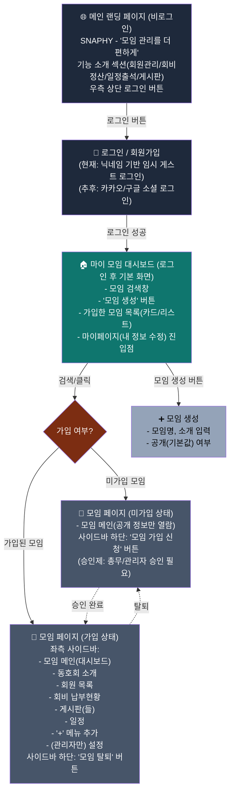

# 모임 관리 플랫폼 (SNAPHY) 서비스 기획서 v2.0

> 작성일: 2026-08-25
> 이전 버전(동호회관리_서비스_기획서.md, v1.0) 이후 논의된 내용을 반영한 업데이트판입니다.
> 본 문서는 나스(NAS) 배포 전환 이후 Claude Code가 이어서 개발할 때 참고하는 기준 문서입니다.

---

## 0. v1.0 대비 변경 핵심 요약

- 서비스명이 "동호회 관리 플랫폼"에서 **"모임 관리 플랫폼(SNAPHY, 가제)"**으로 정리됨
- 로그인 전/후 전체 화면 흐름(랜딩 → 로그인 → 대시보드 → 모임 진입)이 구체화됨
- **권한 체계**(관리자/관리자권한자/커스텀 등급, 위임 방식)가 상세 설계됨
- 모임 메인페이지를 **위젯 기반 대시보드(Notion 연동형)**로 구체화
- 배포 인프라를 **Vercel 임시 배포 → 자체 나스(Synology NAS) 상시 배포**로 전환 결정

---

## 1. 전체 화면 흐름도



---

## 2. 화면별 상세 요구사항

### 2.1 메인 랜딩 페이지 (비로그인)

- 서비스명: **SNAPHY** (가제)
- 네이버 밴드 소개 페이지 같은 정식 랜딩페이지 형태 — 단순 로그인 폼 아님
- 구성:
  - 히어로 섹션: 서비스명 + 캐치프레이즈("모임 관리를 더 편하게") + 한 줄 설명
  - 기능 소개 카드: 회원관리, 회비정산, 일정·출석 관리, 게시판·소통 등
  - "이 서비스를 쓰면 모임 관리가 편해진다"는 걸 전달하는 톤
- 우측 상단 **로그인 버튼**

### 2.2 로그인 / 회원가입

- 현재(개발 단계): 닉네임 입력 후 임시 게스트 로그인
- 추후: **카카오 소셜 로그인 / 구글 소셜 로그인**으로 전환 예정
- 회원가입 시 최소 정보만 수집(닉네임 등), 소셜 로그인 전환 시 대부분 자동 채움

### 2.3 로그인 후 홈 — 마이 모임 대시보드

참고 레퍼런스: 네이버 밴드 "내 밴드" 홈, 네이버 카페 "카페홈"

- 상단: **모임 검색창**
- **모임 생성** 버튼
- **내가 가입한 모임 목록** (카드/리스트, 모임이 활성화되어 보이는 느낌 — 최근 활동 반영)
- **마이페이지**: 개인정보 수정, 가입한 모임 전체 관리(탈퇴 등), 계정 설정

### 2.4 모임 생성

- 최소 입력: 모임명, 소개
- 공개/비공개: **1단계는 공개로만 시작**, 비공개 옵션은 추후
- 모임명 중복 방지 로직 포함

### 2.5 모임 검색 결과 없음

- "찾는 모임이 없어요 → 새로 만들기" 유도 문구 + 버튼

### 2.6 모임 가입 방식

- **승인제**: 가입 신청 → 총무/관리자 승인 후 가입 완료
- 미가입 상태에서도 모임 메인(공개 정보)은 열람 가능
- 사이드바 하단에 상태별 버튼: 미가입 → "모임 가입 신청" / 가입됨 → "모임 탈퇴"

---

## 3. 모임 내부 구조

### 3.1 기본 제공 메뉴(탭)

| 메뉴 | 설명 | 기본 권한 |
|---|---|---|
| 모임 메인(대시보드) | 아래 3.3 참고 | 전체 열람 |
| 동호회 소개 | 모임 소개, 회칙 등 정적 정보 | 관리자 수정 / 전체 열람 |
| 회원 목록 | 엑셀 스타일 테이블, 회비 납부현황 컬럼 포함 | 관리자 열/행 추가삭제수정 |
| 게시판(복수 생성 가능) | 하단 3.4 참고 | 옵션별 상이 |
| 일정 | 일정 등록/수정 + 출석 체크, 일정 목록 ↔ 캘린더 양방향 동기화 | 관리자 수정 / 전체 열람 |
| (+) 메뉴 추가 | 총무/관리자가 새 게시판·일정 등 메뉴를 직접 생성 | 관리자 |
| 설정 | 관리자만 노출. 아래 3.5, 4 참고 | 관리자 전용 |

### 3.2 회원 목록 상세

- 엑셀 스타일 테이블: 열/행 자유 추가·삭제·수정 가능(관리자)
- 회비 납부현황을 컬럼으로 관리, 저장 시점 스냅샷 반영
- 1단계 구현 범위: **사전 정의 템플릿 + 컬럼명 커스터마이징** 축소판으로 시작 (완전 자유 폼빌더는 이후 확장)

### 3.3 모임 메인페이지(대시보드) — Notion 연동형

- 각 메뉴(일정, 게시판 등)에 등록된 내용이 **메인페이지에 위젯처럼 자동 연동**되어 노출
  - 예: 일정 캘린더 + 그 아래 다가오는 일정 목록
- 관리자가 **어떤 위젯을 어떤 순서로 노출할지 배치** 가능 (게시판 우선/일정 우선 등)
- **공지 작성 시 날짜 지정 → 캘린더에도 자동 표시** (공지-일정 연동)
- **고정(핀) 공지**: 특정 공지를 메인 상단에 고정
- **최근 활동 피드**: 새 글/신규 가입 등 최근 활동 노출 → 모임이 활성화되어 보이는 효과
- **모임 내 검색**: 게시글/공지/일정을 모임 안에서 검색

### 3.4 게시판 상세

생성 시 옵션 선택형 구성(Notion 스타일 블록 UI, 카페형 나열 아님):

- **참여 방식**: 회원 글쓰기 허용 / 관리자만 쓰기 허용
- **익명 여부**: 익명 게시판 지원
- **용도 프리셋**: 공지 게시판 / 자유 게시판 / 투표 게시판
- **댓글 기능** 공통 포함
- **문서형 게시물**: 온보딩 자료처럼 워드/블로그 형태의 긴 글 작성 (1단계는 단일 레벨 문서, 하위 페이지 확장은 추후)
- **파일 첨부** 가능한 게시물
- **투표 게시물**: 옵션 응답 및 집계

### 3.5 메뉴별 세부 권한(등급 기반 접근제어)

- 메뉴(게시판/일정/회비 등)마다 등급별로 **읽기/쓰기, 읽기만, 접근불가** 체크 가능
- 참고 모델: 시놀로지 NAS 제어판의 "사용자/그룹별 폴더 접근권한" 방식과 동일한 컨셉
- 등급 이름 자체도 관리자가 자유롭게 생성("+" 버튼으로 등급 추가)
- **1단계 구현 범위**: 고정 3단계 등급(메인관리자/관리자권한자/일반회원) + 메뉴별 단순 노출여부로 축소 시작. 등급 자유생성 + 세밀 권한체크는 1.5단계 이후 확장

---

## 4. 권한 체계 (핵심 설계)

### 4.1 역할 구조

| 역할 | 인원 | 권한 | 탈퇴 |
|---|---|---|---|
| **메인 관리자** | 정확히 1명 | 모든 권한 (모임 삭제 포함) | **탈퇴 불가** — 반드시 다른 사람에게 관리자 위임(요청→수락) 완료해야만 탈퇴 가능 |
| **관리자권한자** | 여러 명 가능 | 메인 관리자와 동일 권한이되, **모임 삭제만 제외**. 회원 강제 탈퇴 권한 포함 | 일반 탈퇴 가능 |
| **커스텀 등급** (회장, 총무, 부회장 등) | 자유 | 관리자가 메뉴별로 세밀하게 권한 설정 | - |

- 관리자(메인/권한자 모두)는 **회원 강제 탈퇴** 권한 보유
- 메인관리자는 관리자권한자 개인별로, **"다른 관리자권한자의 등급을 변경할 수 있는 권한" 자체를 개별 On/Off** 가능 (권한자끼리 서로 못 건드리게 통제 가능)

### 4.2 등급 위임 방식

- 등급별로 위임 방식을 각각 다르게 설정 가능:
  1. **위임요청 → 수락 방식**: 상호 동의가 있어야 위임 완료
  2. **관리자 직권 변경 방식**: 관리자가 즉시 등급 변경 (동의 불필요)
- 단, **메인 관리자 위임만은 예외 없이 항상 "위임요청 → 수락" 고정**
- 회장/총무 등 커스텀 등급은 등급별로 둘 중 선택하여 설정 (모두 동일 적용이 아니라 등급마다 다르게 가능 — 예: 회장은 요청형, 총무는 직권형)
- 위임 이력(누가 언제 누구에게 위임했는지)을 기록으로 남김

### 4.3 안전장치

- 최소 1명의 메인관리자가 항상 존재해야 하며, 마지막 메인관리자는 위임 없이 등급을 낮추거나 탈퇴할 수 없음
- 향후 고객지원팀의 예외적 개입 경로(계정 분실, 모임 방치, 분쟁 등)가 시스템적으로 존재해야 함 — 세부 운영정책은 별도 문서로 추후 수립

### 4.4 알림

- 등급 변경/위임 요청/승인 등에 대한 인앱 알림 필요성 확인됨 — **세부 사양은 추후 일괄 설계** (1단계 범위 아님)

---

## 5. 기능 로드맵 (v1.0 유지 + 갱신)

| 단계 | 기능 |
|---|---|
| **1단계 (첫 출시, 현재 개발 중)** | 랜딩페이지, 로그인(게스트), 마이 모임 대시보드, 모임 생성/검색/가입(승인제), 회원 관리(축소 템플릿), 회비 정산(수동입력)+현황판, 일정/출석 관리, 게시판(옵션 기반, 댓글), 등급 3단계 고정 + 메뉴별 단순 노출권한 |
| **1.5단계 (빠른 후속)** | 회원목록 컬럼 자유 커스터마이징, 게시판 투표 고도화, Notion 스타일 블록 UI 정교화, 등급 자유생성 + 세밀 권한체크, 메인페이지 위젯 배치 커스터마이징, 총무 위임 상세 플로우 |
| **2단계 (후속)** | 영수증 OCR 지출관리, 카카오 알림톡 연동 |
| **제외** | 실시간 채팅 (카카오톡으로 역할 분리) |

---

## 6. 계정/로그인, 가격, 경쟁 구도

*(v1.0에서 변경 없음, 요약만 유지)*

- 로그인: 총무+회원 개별 계정, 현재 게스트 → 추후 카카오/구글 소셜
- 가격/결제: MVP 개발 후 결정 (TBD), 결제 연동은 포트원 예정
- 경쟁 구도: 카카오뱅크 모임통장 등과 달리, 돈을 직접 보관하지 않고 **은행 무관 정산기록 + 운영관리 + 커스터마이징 자유도**로 차별화

---

## 7. 인프라 / 배포 (v1.0 대비 확정된 내용)

### 7.1 배포 전환 배경

- 개발 초기 Vercel + 클라우드 세션 조합으로 미리보기 진행했으나, **응답 속도 저하**로 자체 나스(Synology NAS) 배포로 전환 결정
- 나스는 이미 두 개의 서비스(`carpwood.co.kr`, `allseup.co.kr`)를 안정적으로 운영 중이라 성능은 충분한 것으로 판단

### 7.2 저장소 구조

- **origin(메인 작업용)**: GitHub — `MTManagement/meeting-management` (claude.ai/code 클라우드 세션이 공식 지원하는 유일한 host)
- **backup(백업용)**: Gitea 자체호스팅 — `git.snaphy.co.kr/MTManagement/meeting-management`
- "푸쉬해줘" 요청 시 커밋 후 origin/backup 두 곳 모두에 push

### 7.3 배포 아키텍처 (allseup 패턴 재사용)

기존 `allseup` 프로젝트의 2-컨테이너 구조(자동 웹훅 빌드 + 수동 빌드 컨트롤 패널)를 참고하여 `MTManagement` 전용으로 신규 구성:

```
/volume1/docker/mtmanagement/
  ├── repo/            (GitHub 저장소 clone)
  ├── server/           (실제 서비스되는 앱 - rsync 복사 대상)
  └── server-control/   (컨트롤 패널: Dockerfile, docker-compose.yml, server.js, deploy.sh)
```

- **자동 배포**: GitHub 웹훅(`x-hub-signature-256` 서명 검증) → `deploy.sh` 실행 → GitHub pull → rsync → 컨테이너 재빌드
- **수동 배포**: 컨트롤 패널 웹 UI(`/setting/` 경로)에서 시작/중지/강제중지/재시작/수동빌드 버튼 제공 (비밀번호 인증)
- 컨테이너 이름/이미지/포트는 allseup과 겹치지 않게 별도 지정 (포트 예: 3002)

### 7.4 도메인 / 네트워크

- 서브도메인: **`MTManagement.snaphy.co.kr`** (가비아 A레코드 등록 완료, `125.181.128.144`)
- DSM 리버스 프록시로 서브도메인 → 나스 내부 컨테이너 포트 연결
- Let's Encrypt SSL 인증서 발급
- 향후 트래픽/사용자 증가 시 별도 클라우드 호스팅으로 이전 예정 (지금은 나스로 충분)

### 7.5 진행 상태 (2026-08-25 기준)

| 단계 | 상태 |
|---|---|
| 가비아 서브도메인 DNS 등록 | ✅ 완료 |
| GitHub/Gitea 이중 push 구조 확립 | ✅ 완료 |
| 클로드 코드에 배포 시스템(컨트롤패널+자동빌드) 코드 작성 요청 | ✅ 요청 완료, 작업 진행 중 |
| 나스 `/volume1/docker/mtmanagement` 폴더 생성 | ✅ 완료 |
| Container Manager 프로젝트 생성 + 빌드 | ⬜ |
| DSM 리버스 프록시 등록 | ⬜ |
| SSL 인증서 발급 | ⬜ |
| GitHub 웹훅 등록 | ⬜ |
| 테스트 push로 자동배포 확인 | ⬜ |
| Vercel 임시 프로젝트 정리 | ⬜ (나스 배포 확인 후 진행 예정) |

---

## 8. 현재 코드 구현 현황 (참고용 스냅샷, 클로드 코드 세션 기준)

- 스택: Next.js(App Router) + Prisma + PostgreSQL + Tailwind CSS
- 완료: 랜딩/대시보드 분리, 멀티테넌트 모임(Club) 구조, 모임 소개/가입, 회원목록(고정 스키마), 회비정산, 일정/출석, 게시판(옵션 기반)
- 미착수: 소셜 로그인(카카오/구글, 현재 게스트만), 회원목록 컬럼 자유 커스터마이징, 게시판 투표 옵션 및 Notion 스타일 블록 UI, 메뉴(+) 구성 기능, 등급 자유생성 및 세밀 권한체크, 위임 플로우

---

## 9. 미정 항목 (TBD)

| 항목 | 상태 |
|---|---|
| 서비스명/도메인 최종 확정 | 미정 (SNAPHY 가제) |
| 요금제 금액 | MVP 완성 후 결정 |
| 초기 고객 확보 실행 계획 | 미정 (네이버 카페/밴드 채널 활용 방향만 확정) |
| 알림 시스템 상세 설계 | 추후 일괄 설계 |
| 고객지원팀 개입 정책 세부 절차 | 추후 별도 정책 문서화 |
